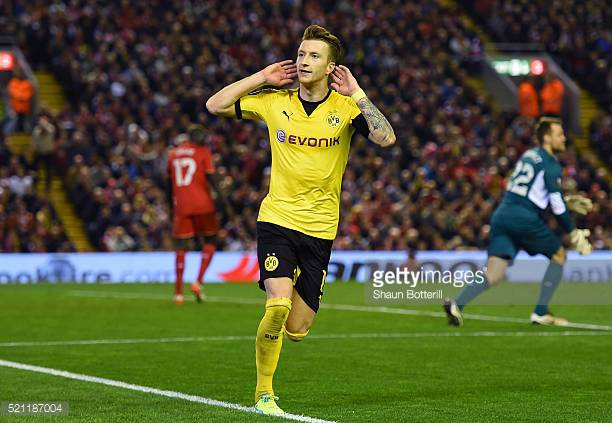
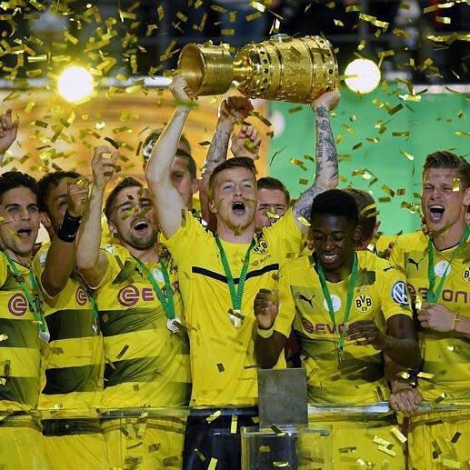

<!DOCTYPE html>
<html>
<head>
  <meta charset="UTF-8" /> <title>Marco Reus</title>
  <link href="style.css" rel="stylesheet" type="text/css"/>
 </head>
 <body >
     <header> 
            <h1 align="CENTER"> Marco Reus<h1>
            <h2 align="CENTER"> <small>Professional football player of the club Borussia Dortmund</small></h2>
     </header>
     <figure >
            
            <figcaption>The emblem of football club Borussia Dortmund</figcaption>
     </figure>
     
     

    
	     <h2 > The achievement of Marco Reus</h2>
	          <ul  class="tb">
	              <li>Bundesliga Team of the Season: 2011-12, 2012-13, 2013-14, 2014-15, 2015-16</li>
			      <li>Bundesliga Team of the Season: 2011-12, 2012-13, 2013-14, 2014-15, 2015-16</li>
			      <li>Bundesliga Breakthrough of the Season: 2011-12</li>
			      <li>Footballer of the Year in Germany: 2012</li>
			      <li>Goal of the Month (Germany): January 2012, June 2012,September 2012</li>
		          <li>UEFA Team of the Year: 2013</li>
		          <li>FIFPro World XI 5th team: 2013, 2014</li>
                  <li>Bundesliga top assists: 2013-14</li>
			      <li>Borussia Dortmund 'Player of the Year': 2013-14</li>
			      <li>UEFA Champions League Team of the Season: 2013-14</li>
			  </ul>
	 

	 <h2 > Career statistics</h2>
	 <table  width="600" >
	     <thead>
	          <tr>
		          <th>Club</th>
			      <th>Season</th>
			      <th>Apps</th>
			      <th>Goals</th>
		     </tr>
        </thead>
	    <tbody>
	         <tr>
		         <td>Rot Weiss Ahlen II</td>
		         <td>2006-2007,2007-2008</td>
		         <td>6</td>
		         <td>3</td>
		     </tr> 
		     <tr>
		         <td>Rot Weiss Ahlen</td>
		         <td>2007-2008,2008-2009</td>
		         <td>44</td>
		         <td>5</td>
		    </tr> 
		    <tr>
		          <td>Borussia Monchengladbach</td>
		          <td>2009-2010,2010-2011,2011-2012</td>
		          <td>109</td>
		          <td>41</td>
		  </tr> 
	  </tbody>
	  <tfoot>
	      <tr>
		         <td>Borussia Dortmund</td>
		         <td>2012-2017</td>
		         <td>189</td>
		          <td>89</td>
	      </tr> 
	 </tfoot>
  </table>
	    
	   <h2 > Images Collection</h2>
	

       <figure  align="CENTER"  >
            
		     
		    

            

            

            

            

            

            

        </figure>

   

      <form name="user" method="POST" action="vitaliy_yuras@ukr.net" >
        <fieldset>
           <legend>Write a message by Marco Reus</legend>
               <label for="user_name">Your name:</label>
	           <input type="text" name="user_name" placeholder="Your name" id="user_name">
	      
	      
              <label for="user_age">Your age:</label>
	          <input type="number" name="user_age" placeholder="Your age" id="user_age">
	      
	      
	          <label >M</label>
	          <input type="radio" name="sex" value="Male"> 
		      <label >F</label>
              <input type="radio" name="sex" value="Female"> 
	      
	       
	          <label for="message" >Message:</label>
              <textarea name="message" id="message"></textarea>
          
	      
             <input type="submit" value="Submit"> 
      </fieldset>
     </form>

	

		 
    

	   <ul>
          
  
		       <a href="https://en.wikipedia.org/wiki/Marco_Reus" target="_blank">Wikipedia</a>    
		       <a href="https://www.instagram.com/marcinho11/" target="_blank">Instagram</a>   
		       <a href="https://www.facebook.com/MarcoReus11/" target="_blank">Facebook</a>     
		       <a href="https://twitter.com/woodyinho" target="_blank">Twitter</a>
		 

	     
	   </ul>
	   
	

 </body>
 </html>
